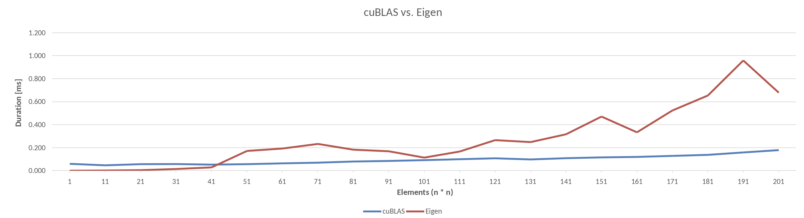

# Assignment03 MatMul

## Assesment

Punkte werden wie folgt vergeben:

Code
- ½P für die korrekte Verwendung der CUDA API

Implementierungen
- ½P für eine CUDA basierte Matrix-Multiplikation, welche hauptsächlich das Global-Memory benutzt
- 2P für eine CUDA basierte Version, welche das Shared-Memory korrekt benutzt und so tendenziell schneller ist als vorherige Version.
- 2P für eine CUDA basierte Version, welche tendenziell noch schneller/optimierter ist als die vorherige Shared-Memory Version.

oder

- 2P für eine optimierte CPU Version, welche gegen die Implementierung von cuBLAS antritt.

Dokumentation
- ½P für die sinnvolle Untersuchungen/Messungen mit den CUDA Profiling Tools und deren Analyse. Ein sauberes Zeit-Profiling aller gewählten Ansätze (ebenso vs CPU Code). Unterscheiden Sie zwischen Init-Aufwand und der wiederholten Ausführung des Codes/der Kernel.
- ½P für eine saubere Dokumentation der verwendeten Ansätze und des allgemeinen Aufbaus des Codes. Sowie sinnvollen Schlussfolgerungen der erarbeiteten Resultate.


## Benchmarks
The benchmark section describes the findings of benchmarking [cuBLAS against Eigen](#cublas-vs-eigen), and benchmarking my own implementations (a [naive one](#naive-implementation), which mainly operates on the global memory of the GPU, and a [shared one](#shared-implementation) which uses shared memory of the GPU) made for this assignment agains a naive CPU version.

### cuBLAS vs. Eigen
This part describes the benchmarks of [cuBLAS](https://developer.nvidia.com/cublas) against [Eigen](https://eigen.tuxfamily.org/index.php?title=Main_Page). The code can be found [here](./cuBLAS_Eigen/src/). The raw export of the benchmark results can be found in [benchmark_export.txt](./cuBLAS_Eigen/benchmark_export.txt). The graphs where created in Excel, and the respecive file can be found in [benchmark.xlsx](./cuBLAS_Eigen/benchmark.xlsx)

**Why Eigen**? Eigen claims to be "*fast, reliable and has good compiler support*" from [the Eigen website](https://eigen.tuxfamily.org/index.php?title=Main_Page).
They claim to use up to AVX512 when possible, which sounds promising. Also, asking DuckDuckGo which matrix matrix multiplication libraries for c++ are available, the name Eigen is often mentioned (for example [here](https://stackoverflow.com/questions/4562231/whats-a-good-c-library-for-matrix-operations), [here](https://stackoverflow.com/questions/1380371/what-are-the-most-widely-used-c-vector-matrix-math-linear-algebra-libraries-a) and [here](https://www.quantstart.com/articles/Eigen-Library-for-Matrix-Algebra-in-C/)).

#### Compiling
To compile the benchmark kernel, either use the `compile.sh` script stored under `cuBLAS_Eigen/src/`, or use the following command in the same directory:

```
nvcc kernel.cu -lcublas --expt-relaxed-constexpr -O2 -Xcompiler -fopenmp -Xcompiler -mavx -o kernel
```

- `-lcublas`: Link the cublas library
- `--expt-relaxed-constexpr`: Use experimental constexpr features of nvcc compiler
- `-O2`: Optimize for speed
- `-Xcompiler`: Tell the underlying compiler (the one nvcc wraps)
    - `-fopenmp`: enable openMP
    - `-mavx`: enable AVX
- `-o kernel`: output the executeable as file `kernel`

After that, an executable `kernel` is generated, whcih can executed with `./kernel`

#### cuBLAS implementation
The cuBLAS implementation requires nearly the same steps as my [shared](#shared-implementation) and [naive](#naive-implementation) implementations.
```cpp
float runCublas(cublasHandle_t& handle, float* matrixA, float* matrixB, float* matrixResult, int dimSize) {
    int size = dimSize * dimSize;
    cudaEvent_t start, stop;
    gpuErrCheck(cudaEventCreate(&start));
    gpuErrCheck(cudaEventCreate(&stop));
    gpuErrCheck(cudaEventRecord(start, 0));
    // Allocate the arrays on device
    float *d_matrixA, *d_matrixB, *d_result;
    gpuErrCheck(cudaMalloc(&d_matrixA, size * sizeof(float)));
    gpuErrCheck(cudaMalloc(&d_matrixB, size * sizeof(float)));
    gpuErrCheck(cudaMalloc(&d_result, size * sizeof(float)));

    // Copy data from host do device
    gpuErrCheck(cudaMemcpy(d_matrixA, matrixA, size * sizeof(float), cudaMemcpyHostToDevice));
    gpuErrCheck(cudaMemcpy(d_matrixB, matrixB, size * sizeof(float), cudaMemcpyHostToDevice));

    const float alpha = 1;
    const float beta = 0;
    cublasErrCheck(
        cublasSgemm(handle,           // handle to the cuBLAS library context
                    CUBLAS_OP_N,      // no transpose, even though the original matrices are row-major and cublas uses col-major
                    CUBLAS_OP_N,      //                                  "
                    dimSize,          // number of rows in matrix A and Result
                    dimSize,          // number of columns in Matrix B and Result
                    dimSize,          // number of rows in matrix A and columns in Matrix B
                    &alpha,           // scalar for multiplication
                    d_matrixA,        // Matrix A
                    dimSize,          // leading dimension of two-dimensional array used to store each matrix A[i].
                    d_matrixB,        // Matrix B
                    dimSize,          // leading dimension of two-dimensional array used to store each matrix B[i].
                    &beta,            // Scalar when A*B +C, where C is 0 when only multiplication is needed
                    d_result,         // Result Matrix
                    dimSize)          // Leading dimension of a two dimensional array use to store the matrix Result[i]
    );

    // Copy results to host memory
    gpuErrCheck(cudaMemcpy(matrixResult, d_result, size * sizeof(float), cudaMemcpyDeviceToHost));

    //Free GPU memory
    gpuErrCheck(cudaFree(d_matrixA));
    gpuErrCheck(cudaFree(d_matrixB));
    gpuErrCheck(cudaFree(d_result));
    gpuErrCheck(cudaEventRecord(stop, 0));
    gpuErrCheck(cudaEventSynchronize(stop));

    float executionTime = 0.0;
    gpuErrCheck(cudaEventElapsedTime(&executionTime, start, stop));
    return executionTime;
}
```
- In a first step, the execution measuring events are created, and the start event is recorded. Furthermore, memory is allocated on the device, copied from host to device and later copied back from device to the host. This works exactly the same as the other GPU implementations.
- The actual cuBLAS call is `cublasSgemm` (cublas `S`ingle precision floating point `ge`neral `m`atrix `m`ultiplication). Since the device memory only contains the data but no infomration on how to read them, the function must know how the data is structured and what the dimensions of the matrices are.
- Like calls to CUDA, cuBLAS return either 0 when everything was correct, or anything else when something went wrong. For this, the macro made for the GPU error check was copied and all CUDA parts were replaced by their cuBLAS equivalent.

The cuBLAS implementation requires column-major matrices for the multiplication (this means that the multiplication is done like the matrices were transposed), but row-major matrices are used in this program. One possibility would be to transpose (using `CUBLAS_OP_T` instead of `CUBLAS_OP_N`)the two input matrices (which makes row-major into column-major), however the ouput matrix would also require transposing, because $ A^T * B^T = (AB)^T = C^T $
Removing the transpose operation on each side of the equation will result in $ A * B = (AB) = C $, thus no transpose is necessairy.
The same is true for the Eigen implementation.

#### Eigen implementation
Using Eigen is quite straight forward. It requires 5 lines of code and no data has to be copied.
```cpp
using Eigen::MatrixXf;
void runEigen(float* matrixA, float* matrixB, float* matrixResult, int dimSize){
    // create eigen matrix but using the already allocated and initialized arrays
    Eigen::Map<MatrixXf> eigenMatrixA(matrixA, dimSize, dimSize);
    Eigen::Map<MatrixXf> eigenMatrixB(matrixB, dimSize, dimSize);
    Eigen::Map<MatrixXf> eigenResult(matrixResult, dimSize, dimSize);

    // Calculate
    eigenResult = eigenMatrixA * eigenMatrixB;
}
```
`MatrixXf` initializes a dynamic matrix (size not known at compile time) of the datatype float. `Eigen::Map` allows to map the internal datastructure of the matrix to an existing array. Thus, the passed pointers are directly mapped to the respective Eigen matrices.
Finally, using overloaded operators, matrix A and matrix B can simply be multiplied with `*`.

#### Benchmarking code
To easily benchmark code, a function which benchmarks the two implementations exists.
```cpp
void runBenchmark(cublasHandle_t& handle, int start, int stop, int stride, bool runCPU) {
    for(int DIM_SIZE = start; DIM_SIZE <= stop; DIM_SIZE+= stride){
        float* matrixA = new float[DIM_SIZE * DIM_SIZE];
        float* matrixB = new float[DIM_SIZE * DIM_SIZE];
        populateMatrixBuffer(matrixA, matrixB, DIM_SIZE);

        // Run cuBLAS
        float* cuBLASresult = new float[DIM_SIZE * DIM_SIZE];
        float cublasExecTime = runCublas(handle, matrixA, matrixB, cuBLASresult, DIM_SIZE);

        if(runCPU) {
            // Run Eigen
            auto startTimeEigen = std::chrono::high_resolution_clock::now();
            float* eigenResult = new float[DIM_SIZE * DIM_SIZE];
            runEigen(matrixA, matrixB, eigenResult, DIM_SIZE);
            auto endTimeEigen = std::chrono::high_resolution_clock::now();

            // Output
            auto durationEigen = std::chrono::duration_cast<std::chrono::microseconds>(endTimeEigen - startTimeEigen).count();
            std::cout << DIM_SIZE << "   " <<(double)cublasExecTime << "   " << (double)durationEigen / 1000.0 <<std::endl;

            delete[] eigenResult;
        } else {
            std::cout << DIM_SIZE << "   " <<(double)cublasExecTime << std::endl;
        }

        delete[] cuBLASresult;
        delete[] matrixA;
        delete[] matrixB;
    }
}
```
1. Create two baseline matrices using the `populateMatrixBuffer` function of size dimSize x dimSize
2. Run the cuBLAS implementation, which returns the time the execution took
3. If the CPU implementation should also be run, it does the same for the Eigen implementation (needed because for large matrix sizes the implementation would run too long)
4. Dependend if the Eigen implementation was also run, the output is made.

CuBLAS needs a handler which it can run on. This handler is the same for each matrix multilication iteration and gets created only once, and then passed to the functions.
```cpp
int main() {
    cublasHandler_t handler;
    cublasCreate(&handler);
...
```

Before starting the benchmark, a short test is run to check if the APIs are accessed correctly.
```cpp
std::cout << "RUNNING CHECK... ";
if(runCheck(handle)) {
    std::cout << "OK" << std::endl;
} else {
    std::cout << "FAILED!" << std::endl;
    return 1;
}
```
The test simlpy creates a 32 x 32 matrix, runs both runner functions of the cuBLAS and Eigen implementations, and checks the result of both against the naive CPU implementation. It is the same as the `runBenchmark` function, this however returns a bool which is true when the results are equal (in the meaning of the [`compareResultVec`](#result-checking) function).

After that, a short warmup with 4096x4096 elements is made. It uses the `runBenchmark` method with size 4096 to 4096 with a stride of 1, which executes the code once for a 4096x4096 matrix
```cpp
// Warmup
runBenchmark(handle, 4096, 4096, 1, true);
```

Finally, the benchmark is started. It tests the ranges [1 ... 5001] with a stride of 10, [5000 ... 10000] with a stride of 1000, and [10000 ... 26000] with a stride of 1000 but without CPU code (because it would take too long). To stop at 26000 elements seems like an odd number. It is, but running 27000 ends in an `GPUassert: out of memory kernel.cu 91` error.
```cpp
runBenchmark(handle, 1, 5001, 10, true);
runBenchmark(handle, 5000, 10000, 1000, true);
runBenchmark(handle, 10000, 26000, 1000, false);
```

#### Graphs and outcomes
Following are the graphs and outcomes of benchmarking both implementations against eachother.


*Graph 1: Speed comparison of Eigen and cuBLAS matrix multiplication 1 - 5000 as n. Lower = better*
> Above chart shows the time taken to process an n*n matrix. This example shows the full time it took from start to finish, meaning the cuBLAS times also include loading the data from H2D and D2H.

The cuBLAS implementation keeps a low execution time for all elements up to 5000, where as the Eigen implementation starts to get exponentially slower way earlier.


*Graph 2: Speed comparison of Eigen and cuBLAS matrix multiplication 5000 - 26000 as n. Lower = better*
> Above chart shows the time taken to process an n*n matrix. This example shows the full time it took from start to finish, meaning the cuBLAS times also include loading the data from H2D and D2H.

For even larger numbers, the difference is even greater, where waiting for a matrix of dimension 10'000x10'000 to process on the CPU took over 45 seconds.
The cuBLAS implementation also kept going exponentially slower, it however stayed below 10 seconds execution time. At a 27'000x27'000 the GPU ran into an out of memory.


*Graph 2: Speed comparison of Eigen and cuBLAS matrix multiplication 1 - 200 as n. Lower = better*
> Above chart shows the time taken to process an n*n matrix. This example shows the full time it took from start to finish, meaning the cuBLAS times also include loading the data from H2D and D2H.

For smaller matrices up to a dimension of 41x41, Eigen is actually faster than cuBLAS. This is because the GPU always has a certain init time to copy the data from H2D and D2H.

#### Conclusion
To conclude, GPU processing makes a lot of sense when working with large matrices, like images. Whenever smaller matrices are needed, one should still consider using the CPU. Most computers have a strong CPU, but a weak GPU. Using a weaker GPU may result in worse performance than an optimized CPU version.

### Shared/Naive GPU vs CPU
This part describes the benchmarks which where done on the Shared/Naive GPU and CPU implementation made for this assesment. The code can be found [here](./own_implementation/src/). For code profiling, see [analyzing with nvidia nsight tools](#analyzing-with-nvidia-nsight-tools).
The raw export of the benchmark results can be found in [benchmark_export.txt](./own_implementation/benchmark_export.txt). The graphs where created in Excel, and the respecive file can be found in [benchmark.xlsx](./own_implementation/benchmark.xlsx)

#### Benchmarking code
Before benchmarking, ten runs with random matrix sizes are made to check if there might be some issues with the implementations.
```cpp
std::cout << "===================== PROOF =====================" <<std::endl;
srand(time(NULL));
for(int i = 0; i < 5; i++){
    if(runBenchmarkWithCompare(rand() % CPU_MAX_DIMENSION + 1)){
        std::cout << "Passed!" <<std::endl;
    } else {
        std::cout << "Failed!" <<std::endl;
        return 1;
    }
}
```

The proof part uses a function called `runBenchmarkWithCompare`. This method executes all DIM_SIZES on all three implementations regardless of size.
```cpp
bool runBenchmarkWithCompare(int DIM_SIZE) {
    std::cout << "================> DIM_SIZE: " << DIM_SIZE << std::endl;
    float* matrixA = new float[DIM_SIZE * DIM_SIZE];
    float* matrixB = new float[DIM_SIZE * DIM_SIZE];
    populateMatrixBuffer(matrixA, DIM_SIZE);
    populateMatrixBuffer(matrixB, DIM_SIZE);
    bool resultsEqual = true;

    // GPU Shared
    float* sharedGpuResult = new float[DIM_SIZE * DIM_SIZE];
    SharedGpuMatMul sharedGpuMatMul(matrixA, matrixB, sharedGpuResult, DIM_SIZE);

    // GPU Naive
    float* naiveGpuResult = new float[DIM_SIZE * DIM_SIZE];
    NaiveGpuMatMul naiveGpuMatMul(matrixA, matrixB, naiveGpuResult, DIM_SIZE);

    // CPU
    float* cpuResult = new float[DIM_SIZE * DIM_SIZE];
    CpuMatMul cpuMatMul(matrixA, matrixB, cpuResult, DIM_SIZE);

    resultsEqual &= naiveGpuMatMul == sharedGpuMatMul;
    resultsEqual &= naiveGpuMatMul == cpuMatMul;
    resultsEqual &= sharedGpuMatMul == cpuMatMul;

    delete[] matrixA;
    delete[] matrixB;
    delete[] sharedGpuResult;
    delete[] naiveGpuResult;
    delete[] cpuResult;

    return resultsEqual;
}
```
The method simply creates two baseline matrices A and B which are sent to all three implementations. Afterwards, the objects are compared with eachother (using the `operator==` implemented in `IMatMul`).

Then a little warmup is run for all three implementations. This lets each implementation run on it's maximum size once.
```cpp
std::cout << "===================== WARMUP =====================" << std::endl;
runBenchmark(CPU_MAX_DIMENSION);  // Warms up with max matrix size the CPU handles
runBenchmark(GPU_NAIVE_MAX_DIMENSION); // Warms up with max matrix size the Naive GPU implementation handles
runBenchmark(GPU_SHARED_MAX_DIMENSION); // Warms up with max matrix size the Shared Memory implementation handles
```

Last but not least, the implementation are tested against eachother in different ranges with different strides. First one lets all implementations run matrices with sizes [1, 11, 21 ... 991]. Then, Matrices in the range [1000, 1100, 1200 ... 4000] are run. And finally, matrices between 32 and `GPU_SHARED_MAX_DIMENSION` with a step of a left shift [32, 64, 128 ... GPU_SHARED_MAX_DIMENSION] are run.
```cpp
std::cout << "===================== Nums 1 - 1000, spaced 10 =====================" <<std::endl;
for(int DIM_SIZE = 1; DIM_SIZE <= 1000; DIM_SIZE += 10) {
    runBenchmark(DIM_SIZE);
}
std::cout << "===================== Nums 1000 - 4000, spaced 100 =====================" <<std::endl;
for(int DIM_SIZE = 1000; DIM_SIZE <= 4000; DIM_SIZE += 100) {
    runBenchmark(DIM_SIZE);
}
std::cout << "===================== Nums divideable by 32 =====================" <<std::endl;
for (int DIM_SIZE = 32; DIM_SIZE <= GPU_SHARED_MAX_DIMENSION; DIM_SIZE <<= 1) {
    runBenchmark(DIM_SIZE);
}
```

The warmup and the actual benchmark use a function `runBenchmark`. It basically does the same as `runBenchmarkWithCompare`, but it does not compare the results. It also has thresholds where it deactivates certain algorithms, which can be configured by setting the defines at the top of [kernel.cu](./own_implementation/src/kernel.cu).
```cpp
#define CPU_MAX_DIMENSION 1024
#define GPU_NAIVE_MAX_DIMENSION 2048
#define GPU_SHARED_MAX_DIMENSION 4096
```
These thresholds do not have any certain reason. Mainly to hold the execution time of the benchmark reasonably low.

#### Graphs and outcomes

*Graph 1: Speed comparison of Naive/Shared GPU and CPU Matmul. Lower = better*
> Above chart shows the time taken to process an n*n matrix. This example shows the full time it took from start to finish, meaning the GPU times also include loading the date from Host2Device and Device2Host.

When looking at the above chart, it is easy to see that both GPU implementations keep fast processing times for quite some time, where as the CPU version gets slow at around 1000 elements.


*Graph 2: Speed comparison of Naive/Shared GPU and CPU Matmul for smaller n. Lower = better*
> Above chart shows the time taken to process an n*n matrix. This example shows the full time it took from start to finish, meaning the GPU times also include loading the date from Host2Device and Device2Host.

For smaller matrix sizes, the CPU is faster up to a matrix of size 64x64.
This is explainable by the initial work the GPU must go through - mainly loading the matrices to the device and copying the results back to the host. This is also confirmed when looking at graph 3 below, which differentiates between loading and processing time.


*Graph 3: Speed comparison of Naive/Shared GPU and CPU Matmul for smaller n, split by loading/processing time. Lower = better*

When comparing the processing times only, both GPU implementations and the CPU take around the same time do the job. However, looking on the right chart, both GPU versions have around 0.25 ms loading time.


*Graph 4: Speed comparison of Naive/Shared GPU, split by loading/processing time. Lower = better*

Comparing both GPU implementations with eachother shows that initializing shared memory only makes a marginal difference in execution time (the shared memory is initialized while the kernel is running). However, the imense speedup one can get from working with shared instead of global memory is gigantic, and are definitely worth implementing.

#### Conclusion
It is not hard to see that implementing matrix multiplication with CUDA may bring enormous performance boosts. However, when investing into hardware that is capable of doing such processing jobs, consider doing it **right**. The global memory implementation may be faster than the CPU version, it however scales nearly as bad as the CPU version (meaning that if the CPU cannot do it in a useful time, the global GPU version might be just as useless).
To conclude, when one is taking the time to learn CUDA, one should take the time to learn it right. And when programming GPUs, **go hard or go home**

## Code Documentation
This part describes the implementation of a shared / naive GPU powered matrix multiplication. The source code can be found [here](./own_implementation/src/).

### Class Hierarchy
For better maintainability, a little class hierarchy for the matmul algorithms was implemented.


- The `IMatMul` interface only implements the `==` operator. This allows to compare two IMatMul's result arrays with eachother by just typing `MatMul1 == MatMul2`. It also contains the CUDA error checker `gpuErrCheck`.
   All IMatMul implementation must have two baseline matrices A and B and the result matrix. Also the dimSize is contained inside the interface, since those four values are always needed to compute the matrix multiplication.
   Also, a prepare and post function must be implemented, which for example copies the baseline matrices to somewhere else. The run method then starts the matrix multiplication and should print the execution time into the console (this however is not enforced).
- The `CpuMatMul` class implements the algorithm to run the CPU matrix multiplication. It uses the naive reference implementation.
- The `IGpuMatMul` interface implements the prepare and post methods to initialize and load the memory `H2D` or `D2H`. It also defines the additional members needed for GPU calculation, like pointers to the matrices on the device memory, and the cuda events required to record the execution time.
- The `NaiveGpuMatMul` and `SharedGpuMatMul` classes implement the run methods, which start the respective algorithms on the GPU.

To use any of the MatMul implementations, simply create a new object from any of the implementations.
```cpp
// Make a CPU run
CpuMatMul cpu(float* baselineA, float* baselineB, float* result, int dimSize);
// Make a naive GPU run
NaiveGpuMatMul naiveGpu(float* baselineA, float* baselineB, float* result, int dimSize);
// Make a shared GPU run
SharedGpuMatMul sharedGpu(float* baselineA, float* baselineB, float* result, int dimSize);
```
Instanciation automatically initializes the classes and also starts the computation.

### Result checking
The baseline comparator was given by the course instructor, it however tested if each value was completely equal to one another. Since float value comparison (especially with error = 0) makes no sense, the method was rewritten to consider floating point inaccuracies.
```cpp
bool operator==(IMatMul& other) {
    int size = m_dimSize * m_dimSize;
    for (int i = 0; i < size; i++) {
        // checks against standard c++ float epsilon
        if(abs(m_resultMatrix[i] - other.m_resultMatrix[i]) > __FLT_EPSILON__) {
            return false;
        }
    }
    return true;
}
```
This implementation checks for each value in the two result matrices, if the difference is inside the C++'s standard float epsilon.

### GPU Loading operation
The GPU loading operations are the operations that need to be done to load the data to the GPU (`H2D`) or to load the data back to the Host (`D2H`). For both naive and shared implementations, the loading operations are the same and are thus implemented in the IGpuMatMul interface.

#### Host 2 Device
First, the `H2D` operations are made.
```cpp
virtual void prepare() {
    m_memorySize = m_dimSize * m_dimSize * sizeof(float);

    // Load data and stop time of this
    gpuErrCheck(cudaEventCreate(&m_loadingStartEvent));
    gpuErrCheck(cudaEventCreate(&m_loadingStopEvent));
    gpuErrCheck(cudaEventRecord(m_loadingStartEvent, 0));
    gpuErrCheck(cudaMalloc(&m_d_matrixA, m_memorySize));
    gpuErrCheck(cudaMalloc(&m_d_matrixB, m_memorySize));
    gpuErrCheck(cudaMalloc(&m_d_matrixC, m_memorySize));
    gpuErrCheck(cudaMemcpy(m_d_matrixA, m_baselineMatrixA, m_memorySize, cudaMemcpyHostToDevice));
    gpuErrCheck(cudaMemcpy(m_d_matrixB, m_baselineMatrixB, m_memorySize, cudaMemcpyHostToDevice));
    gpuErrCheck(cudaEventRecord(m_loadingStopEvent, 0));
    gpuErrCheck(cudaEventSynchronize(m_loadingStopEvent));

    // Start calculation event
    gpuErrCheck(cudaEventCreate(&m_calculationStartEvent));
    gpuErrCheck(cudaEventCreate(&m_calculationStopEvent));
    gpuErrCheck(cudaEventRecord(m_calculationStartEvent, 0));
}
```
To differentiate between processing time and loading time, the prepare method creates calculationEvents and loadingEvents. Those are used to measure the time it took to
- allocate memory for the three matrices A, B and C (`cudaMalloc`).
- copy the baseline matrices A B to the newly allocated matrices (`cudaMemcpy`).

After that, it starts the calculation event, and as a next step start the computation.

#### Device 2 Host
Secondly, after computation, the `D2H` operations are made.
```cpp
virtual void post() {
    float executionTime;
    float h2dloadingTime;
    float d2hloadingTime;

    // Finish recording of caluclation event and calculate exection time
    gpuErrCheck(cudaEventRecord(m_calculationStopEvent, 0));
    gpuErrCheck(cudaEventSynchronize(m_calculationStopEvent));
    gpuErrCheck(cudaEventElapsedTime(&executionTime, m_calculationStartEvent, m_calculationStopEvent));
    gpuErrCheck(cudaPeekAtLastError());

    // Calculate h2d loading time
    gpuErrCheck(cudaEventElapsedTime(&h2dloadingTime, m_loadingStartEvent, m_loadingStopEvent));

    // Record and calculate d2h loading time and time to free memory
    gpuErrCheck(cudaEventRecord(m_loadingStartEvent, 0));
    gpuErrCheck(cudaMemcpy(m_resultMatrix, m_d_matrixC, m_memorySize, cudaMemcpyDeviceToHost));
    gpuErrCheck(cudaFree(m_d_matrixA));
    gpuErrCheck(cudaFree(m_d_matrixB));
    gpuErrCheck(cudaFree(m_d_matrixC));
    gpuErrCheck(cudaEventRecord(m_loadingStopEvent, 0));
    gpuErrCheck(cudaEventSynchronize(m_loadingStopEvent));
    gpuErrCheck(cudaEventElapsedTime(&d2hloadingTime, m_loadingStartEvent, m_loadingStopEvent));

    std::cout << m_timeReportPrefix << " GPU time [ms]: " << executionTime << " " << h2dloadingTime + d2hloadingTime << std::endl;
}
```
1. The execution operation event is stopped and the time it took is calculated and saved into `executionTime`.
2. The `D2H` loading time is calculated and saved into `h2dLoadingTime`
3. The two "loading" events are reused to measure the `H2D` loading time and free operation `cudaFree` which is then saved into `d2hLoadingTime`.

Finally, the execution time is printed to the console.

### Naive Implementation
The naive implementation is stored inside the [kernel.cu](./own_implementation/src/kernel.cu) file, since CUDA enforces all `__global__` CUDA methods to be in a `.cu` file and are not allowed in classes. The naive implementation is called naive because it just loads the data into global memory and works on it. This might not sound naive (because we use a GPU), but it actually is because matrix multiplication requires a lot of memory access, which is slow on global memory.

#### Launching
```cpp
virtual void run() {
    // Start the naive implementation with dimSize * dimSize blocks (one thread per result)
    matMulGpuNaive<<<dim3(m_dimSize, m_dimSize), dim3[1,1]>>>(
        m_d_matrixA,
        m_d_matrixB,
        m_d_matrixC,
        m_dimSize
    );
}
```
The naive implementation launches one block with one thread for each index in the matrix. This means, that $ dimSize * dimSize $ Threads are launched. Each block then calculates the value of one field in the matrix. The amount of threads is equal to the amount of elements inside the matrix.

#### Kernel
```cpp
__global__ void matMulGpuNaive(float* d_matrixA, float* d_matrixB, float* d_matrixC, int dimSize) {
    int row = blockIdx.y*blockDim.y+threadIdx.y;
    int col = blockIdx.x*blockDim.x+threadIdx.x;
    if(row < dimSize && col < dimSize){
        float sum = 0;
        for(int i = 0; i < dimSize; i++) {
            sum += d_matrixA[row * dimSize + i] * d_matrixB[i * dimSize + col];
        }
        d_matrixC[row * dimSize + col] = sum;
    }
}
```
The naive kernel simply takes it's global y-ID and it's global x-ID to determine which value it needs to calculate. Then, it simply iterates through the columns of Matrix B and the rows of Matrix A, multiplying and adding the values together and finally safe them into the result matrix. The global memory could be used even heavier in this example by not adding summing together the values in a local value, but directly on the global memory.


Above gif shows how the matrices A, B and result are accessed to calculate the result for the light green block [0,0] (row is equal to $ 0 * dimSize + 0 = 0$, and col is equal to $ 0 * dimSize + 0 = 0$ ).
Those are a lot of global memory accesses. Especially considering that for example matrix B's first column is loaded n (in an n * n matrix) times to compute the result matrix's first column.

### Shared implementation
The shared implementation is stored inside the [kernel.cu](./own_implementation/src/kernel.cu) file for the same reason as the naive version. The shared matmul uses the gpu's shared memory to improve performance through loading oftenly read data into the shared memory of the kernel. Ideally, the whole matrix would be loaded inside the shared memory, however, it is not big enough for a 4096x4096 or even larger matrix.
To bypass this, a so-called tiled matrix multiplication has to be done. Tiled means, that the matrix is split into multiple tiles, which can be calculated in parallel. Each block computes the tile it is assigned to.
In this implementation, a tile width of 32 is used. By the way, setting the tile width to 1 would result back in the naive version.

#### Launching
Since the matrix size changes, the amount of tiles also changes. In the run method of the `SharedGpuMatMul` class, the amount of tiles is calculated.
```cpp
virtual void run() {
    // determine block size -> if dimSize is larger than TILE_WIDTH, computer, else just use one
    int blockSize = 1;
    if(m_dimSize > TILE_WIDTH) {
        blockSize = (m_dimSize / TILE_WIDTH);
        if(m_dimSize % TILE_WIDTH != 0) {
            blockSize += 1;
        }
    }
    dim3 blocks(blockSize, blockSize);
    dim3 threads(TILE_WIDTH, TILE_WIDTH);

    // run the shared implementation
    matMulGpuShared<<<blocks, threads>>>(
        m_d_matrixA,
        m_d_matrixB,
        m_d_matrixC,
        m_dimSize
    );
}
```
The amount of tiles is equal to the amount of processing blocks. One processing block has `TILE_WIDTH` * `TILE_WIDTH` threads.
- When the matrix width is less than `TILE_WIDTH`, the kernel gets one block.
- Since integer divisions are always floored in C++, `blockSize` must be incremented when the matrix dimension modulo `TILE_WIDTH` is not null (because a 33 x 33 matrix would require 1.03125 tiles, which is floored to 1)

After initializing the kernel's parameters, it is started.

#### Kernel
```cpp
__global__ void matMulGpuShared(float* d_matrixA, float* d_matrixB, float* d_matrixC, int dimSize) {
    __shared__ float matrixAshared[TILE_WIDTH][TILE_WIDTH];
    __shared__ float matrixBshared[TILE_WIDTH][TILE_WIDTH];
    int row = blockIdx.y * TILE_WIDTH + threadIdx.y;
    int col = blockIdx.x * TILE_WIDTH + threadIdx.x;
    int idx = 0;

    float sum = 0;
    // calculate
    for(size_t nTile = 0; nTile < gridDim.x; ++nTile) {

        // Matrix A (1)
        idx = row * dimSize + nTile * TILE_WIDTH + threadIdx.x;
        if(idx >= dimSize * dimSize) {
            matrixAshared[threadIdx.y][threadIdx.x] = 0; // padded
        } else {
            matrixAshared[threadIdx.y][threadIdx.x] = d_matrixA[idx];
        }

        // Matrix B (1)
        idx = col + (nTile * TILE_WIDTH + threadIdx.y) * dimSize;
        if(idx >= dimSize * dimSize) {
            matrixBshared[threadIdx.y][threadIdx.x] = 0; // padded
        } else {
            matrixBshared[threadIdx.y][threadIdx.x] = d_matrixB[idx];
        }
        __syncthreads(); // (2)

        // (3)
        for(int tileElement = 0; tileElement < TILE_WIDTH; ++tileElement) {
            sum +=  matrixAshared[threadIdx.y][tileElement] * matrixBshared[tileElement][threadIdx.x];
        }
        __syncthreads(); // (4)
    }
    if(row < dimSize && col < dimSize) {
        d_matrixC[row * dimSize + col] = sum;
    }
}
```
The shared kernel is nearly identical to the naive version, except that the shared memory has to be maintained.
`row` and `col` are dependend on the block ID, the `TILE_WIDTH` and the thread ID. If for example block [1,1] is accessed, then the thread [0,0] would be at position [32,32].
After determining the row and column, all elements in a tile are calculated. This means, when the `for`-loop is finished, all elements inside the tile are completely calculated.


Above gif shows how one block (in this example [0,0]) processes all elements inside a tile. The kernel may work with a `TILE_WIDTH` of 32 and the example with a `TILE_WIDTH` of 2, however, the idea is exactly the same.
1. The data is loaded from global memory into shared memory. (grey block in Matrix A and B)
   Firstly, `idx` describes where in Matrix A on the global memory the value for this tile and thread is
   Secondly, `idx` describes where in Matrix B on the global memory the value for this tile and thread is
   If idx is out of bounds, a padding of 0 is added at the thread's position. In the matrix multiplication, the field is still used, it however does not alter the result. (Because multiplication of the two elements would result in 0, and 0 is the neutral number of additions)
2. Now, all threads must wait for eachother to load the data into the shared memory (enforced with the first `__syncthreads()`). If not, faster threads could read unitialized data, which is bad.
3. All threads compute the parts of the tile that is currently active and relevant to them.
   - Thread [0,0]: B[0,0] * A[0,0] + B[1,0] * A[0,1]
   - Thread [0,1]: B[0,1] * A[0,0] + B[1,1] * A[0,1]
   - ...
4. As soon as all threads have finished the computation for their Element in the tile, the tiles inside the shared memory are exchanged. This may only be done when all threads have finished calculating the operations (enforced with the second `__syncthreads()`). The threads load the tile right to the current one in Matrix A and the tile below the current one in Matrix B.

This Procedure is repeated until the end of matrices A and B is reached.

Finally, the sum is added to the result matrix. This is only done when the row and column of this thread is actually in range.
Imagine above example in the gif calculates a 3x3 matrix, but it would not be checked if row and column is valid:
- Thread [0,1] Block [0,1] → element [0,3] in matrix: Out of range, but translated into 1D still in range. Data would be written into a false space inside the array (element [1,0] in this example)
- Thread [1,1] Block [1,1] → element [ 3,3] in matrix: Out of range, and translated into 1D also out of range. The value would be written into non-allocated space, meaning a segmentation fault!

#### Avoiding bank conflicts
One of the many pitfally when working with shared memory are bank conflicts. Bank conflicts happen whenever two threads inside the same warp access data that is inside the same memory bank.
When loading the two matrices A and B, tiles out of them are saved as two 32x32 arrays.


Accessing the same banks with different threads in the same warp results in bank conflicts (at least when accessing different addresses inside the bank). This means, threads inside a warp of 32 consecutive threads must access different banks. This is possibly by indexing smart.

Firstly, copying data from global to shared memory must be done intelligently. Threads with globalID [0...31], [32...63] etc. must always access different banks. Since there are exactly 32x32 Threads, the "warp ID" can be determined with `threadIdx.y`. All threads that share the same `threadIdx.y` are in the same warp, and must thus access different banks.
Since 2D matrices are saved into the banks, the **second indexer** determines the **bank number**, and the **first indexer** determines the **"height" in the bank**.
```cpp
matrixAshared[threadIdx.y][threadIdx.x] = 0;
matrixAshared[threadIdx.y][threadIdx.x] = d_matrixA[idx];
matrixBshared[threadIdx.y][threadIdx.x] = 0;
matrixBshared[threadIdx.y][threadIdx.x] = d_matrixB[idx];
```
This means, writing the shared memory without bank conflicts is as easy as setting the correct indices.

However, data must also be read from the shared memory.
```cpp
for(int tileElement = 0; tileElement < TILE_WIDTH; ++tileElement) {
    sum +=  matrixAshared[threadIdx.y][tileElement] * matrixBshared[tileElement][threadIdx.x];
}
```
- **Matrix B**: Reading matrix B is not an issue. There, each consecutive thread just reads one value from the bank. In the next iteration, they may read the from the same bank as in the first iteration, but since this is not a parallel access, no bank conflict is made.
- **Matrix A**: All consecutive threads in the same warp read from exactly the same bank (because all share the same `threadIdx.y`), which would result in a 32x bank conflict. However, no bank conflict is generated. CUDA hardware is capable of so-called broadcast (if and only if **all** threads in a warp access the same value), which can be handled in parallel. (An exeption to this is hardware of version >= 2.0, which also allows multicasting. This means if only n threads read from the same bank and the same position, it is also handled in parallel)

This covers all shared memory read and writes in this kernel. That this works is also confirmed by nsight compute, which measured zero bank conflicts.


#### Analyzing with Nvidia Nsight Tools
The Nsight tools analyze the kernel and the GPU it is ran on.

##### Nsight systems
Systems is a profiler that shows which calls to the GPU took how long.


When looking at processing a 1024x1024 matrix, executing the kernel `matMulGpuShared` (and waiting for it to finish) takes up most of the time. Memory allocation of course also takes up some time, but it's not the main time consuming operation


With only a 64x64 matrix on the other hand, allocating the space on the device takes up most of the time. Especially the first call to `cudaMalloc`.

##### Nsight compute
Compute gives clear numbers about the kernel's performance in relation to the GPU's max performance.

###### Speed of light

Nsight's comment about the gpu speed of light ist, that over 80% of the compute throughput possible for this card was used. Memory is not as well used as the compute throughput, at least in debug mode. When profiling in release mode, Nsight states that both are well balanced.

###### Memory

Memory utilization is low, however sufficient enough since most of the time is spent in computing, no bottleneck is experienced through memory latency. Also, no bank conflicts occurr.

###### Warp state

The average amount of cycles a warp is stalled because of some synchronization is 14 cycles. This is rather high. With a different approach in reading and processing data, a lower number could maybe be achieved.

###### FP32 / FP64

The program uses non-fused floating point instructions to calculate the matrix multiplication. For all devices version 2.0 and up, there is a faster and less inacurate method to calculate so-called multiply-add [fma](https://docs.nvidia.com/cuda/floating-point/index.html#the-fused-multiply-add-fma).
To implement this, the following line in the kernel:
```cpp
sum += matrixAshared[threadIdx.y][tileElement] * matrixBshared[tileElement][threadIdx.x];
```
must be replaced with this:
```cpp
sum = fmaf(matrixAshared[threadIdx.y][tileElement], matrixBshared[tileElement][threadIdx.x], sum);
```
However, replacing the operation with `fmaf` does not induce a lower processing time, so this optimization is left out for this code.
